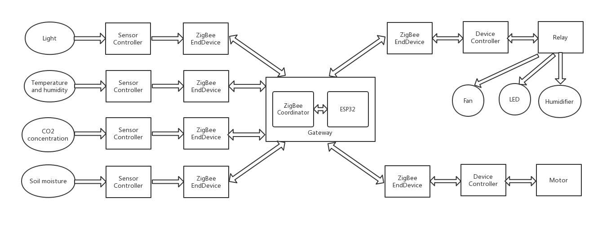

.. _introduction:

传感网络介绍
=======================

拓扑图
-----------------------

实物图
-----------------------

.. image:: img/connect.jpg

程序说明
-----------------------

TBSource(Sensor Controller):
  + sensor.py：传感器控制库，包括DHT11、BH1750、ZZSGTHC、MHZ14A类
  + sensor_controller.py：主程序，获取传感数据，封装成AT指令，通过UART发给ZigBee

TBSource(Device controller):
  + device.py：设备控制库，包括Motor类
  + device_controller.py：主程序，接收AT指令并解析，控制设备进行所要求的操作

SkidsSource(Gateway):
  + umqtt/simple.py：MQTT函数库
  + ATRT.py：AT指令收发库，用于对ZigBee协调器发来的AT指令解析和封装数据成AT指令
  + MSGP.py：MQTT消息处理库，用于对MQTT主题收到的消息进行解析或封装
  + LCD.py：LCD显示库，用于驱动LCD显示收到的传感数据
  + Gateway.py：主程序，接收传感数据并发布到MQTT主题，订阅主题接收MQTT消息并下发

使用说明
-----------------------

1. 修改Gateway.py中的WiFi名称和密码。
#. 将TBSource(Sensor Controller)拷贝到连接着传感器的TB板的PYBFLASH中，主程序名改为main.py，然后复位启动。
#. 将TBSource(Device Controller)拷贝到连接着设备的TB板的PYBFLASH中，主程序名改为main.py，然后复位启动。
#. 将SkidsSource(Gateway)按以上目录结构用uPyCraft工具下载到网关Skids（ZigBee烧的是协调器固件）中，然后运行主程序。
